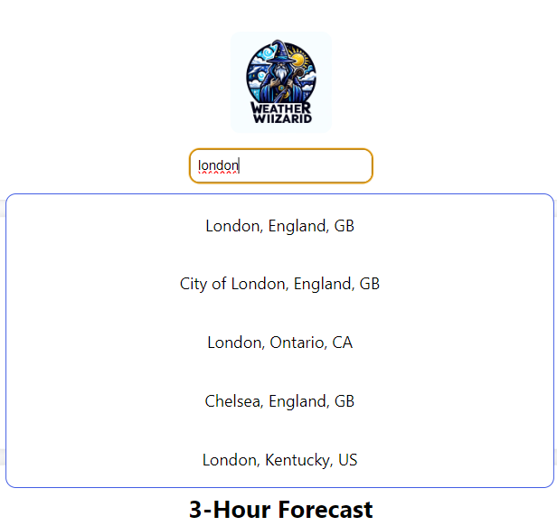
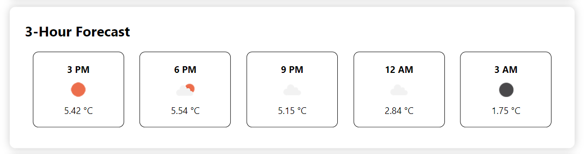
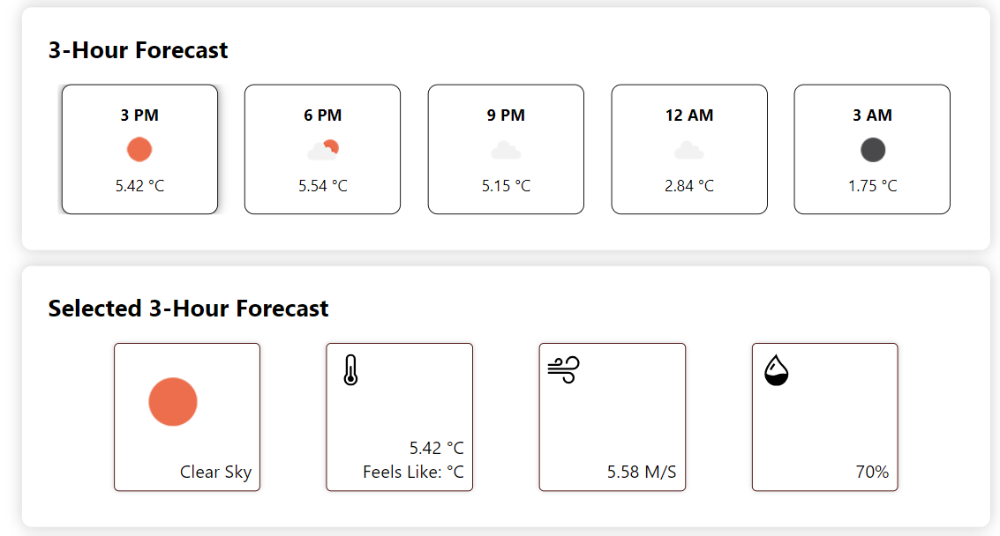
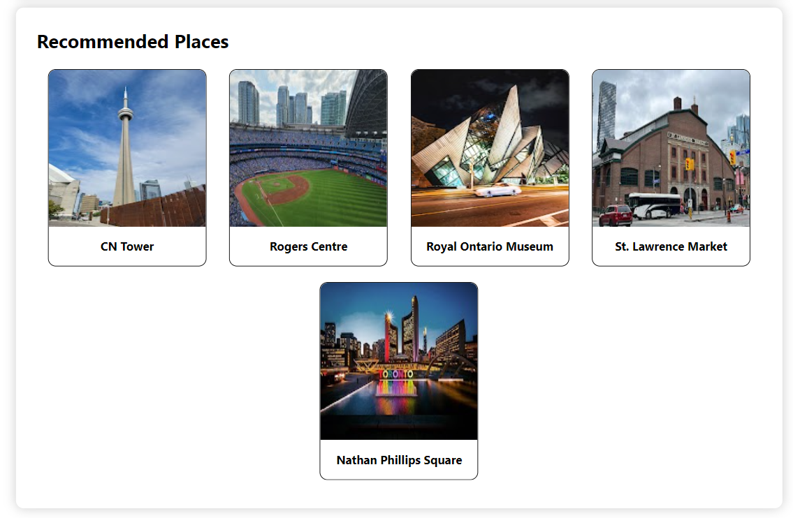

### Project Proposal

#### 1.1 Description

Weather Wizard is a one-stop solution to get real-time weather information for any
location worldwide. Users can view current conditions, forecasts, and weather trends
using simple and intuitive visualizations.

#### 1.2 Problem

People often find themselves switching between different apps and websites to get
comprehensive weather details. There's a need for a consolidated platform that provides
all relevant information in a user-friendly manner.

#### 1.3 User Profile

Travelers, event planners, farmers, or anyone needing accurate weather information.
Users can search for a location, view current conditions, and weekly forecasts.

#### 2. Client-side implementation

#### 2.1 Site Map

- Home Page (http://localhost:3000/)
- About Page (http://localhost:3000/about-us)
- Contact Page (http://localhost:3000/contact-us)

#### 3. Server-side implementation

#### 3.1 End Points

- `GET /location/:searchTerm`
  - Returns the coordinates of the place.
- `GET /weather/:lat/:lon`
  - Returns the current weather of the place using the coordinates.
- `GET /3h/:lat/:lon`
  - Returns the hourly weather of the place using the coordinates.
- `GET /places/:lat/:lon`
  - Returns the popular attractions of the place using the coordinates.

#### 3.2 External API

- [OpenWeatherMap](https://openweathermap.org/api)
  - [Current Weather Data](https://openweathermap.org/current) - for current weather
  - [5 day / 3 hour Forecast](https://openweathermap.org/forecast5) - for hourly weather
  - [Geocoding API](https://openweathermap.org/api/geocoding-api) - for getting the coordinates of the place
- [Google Places API](https://developers.google.com/maps/documentation/places/web-service/overview) - for getting the popular attractions of the place and their photos

### Tech-stack Used

- FrontEnd:
  - React
  - JavaScript
  - CSS
  - Libraries: Axios, react-router-dom, react-icons
- BackEnd:
  - NodeJS
  - JavaScript
  - ExpressJS
  - Libraries: Axios, cors, dotenv, nodemon

### Features and/or usage instruction

- User can search for any place using the search bar and get the current weather of that place.
- User can also see the hourly weather of that place.
- User can click on one of the hourly weather to see more details about that hour.
- User can also see the popular attractions of that place.

### How to start the project

- Clone the repo
- Go to the /front-end folder and run `npm install` and then `npm start` to start the front-end react server on http://localhost:3000
- Go to the /server folder and run `npm install` and then `npm run dev` to start the back-end server on http://localhost:5000
- you'll need the following environment variables to run the project.
  - Front-end:
  ```
  REACT_APP_GOOGLE_API_KEY=xxxx
  ```
  - Back-end:
  ```
  PORT=5000
  OPEN_WEATHER_API_KEY=xxxx
  GOOGLE_API_KEY=xxxx
  ```

### API references

- [OpenWeatherMap](https://openweathermap.org/api)
  - [Current Weather Data](https://openweathermap.org/current) - for current weather
  - [5 day / 3 hour Forecast](https://openweathermap.org/forecast5) - for hourly weather
  - [Geocoding API](https://openweathermap.org/api/geocoding-api) - for getting the coordinates of the place
- [Google Places API](https://developers.google.com/maps/documentation/places/web-service/overview) - for getting the popular attractions of the place and their photos

### Screenshots







### Lessons learned & next steps

- Learned how to use the Google Places API.
- Learned how to use the OpenWeatherMap API.
- Learned how to use the react-router-dom library.

- Next Steps
  - Improve the UI.
  - Add Dark Mode.
  - Add more features like 7 day forecast, etc.